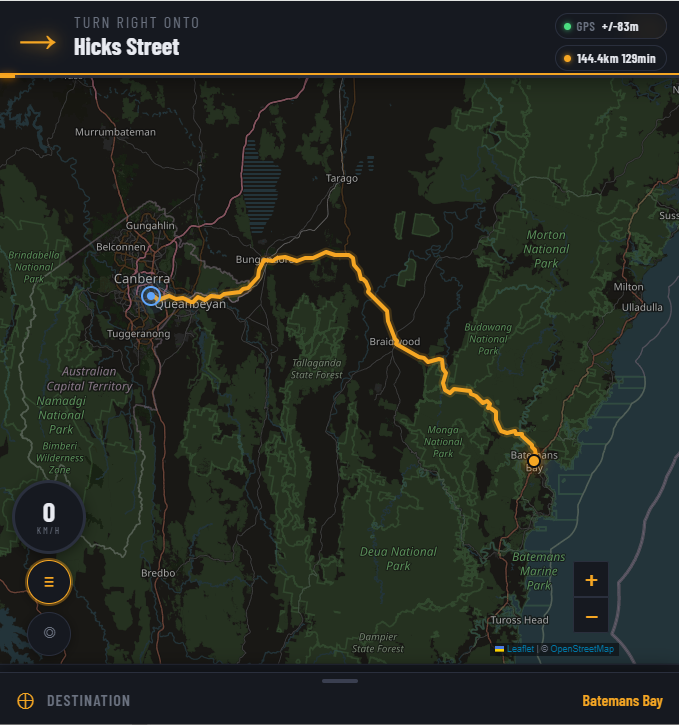

# osm-gps-html

A single-file, self-contained GPS navigator for the browser. No app store,
no backend, no build step, no API keys. One HTML file -- open it and drive.

Built entirely through a conversation with Claude (Anthropic) without the
author writing a single line of code manually. A real-world vibe-coding
experiment that turned into something genuinely useful.

---

## Screenshot

---

## What it does

- **Turn-by-turn navigation** from your current GPS location to any destination
- **Voice input** -- tap the microphone, say where you want to go, confirm by
  voice ("yes" or "no")
- **Speech synthesis** for all navigation instructions using the device's
  built-in voices
- **Speed display** showing current speed in km/h
- **Speed limit display** based on road type, highlighted red when exceeded
- **School zone detection** -- queries OpenStreetMap for schools near the route
  and warns during Australian school hours (weekdays 8:00-9:30am and
  2:30-4:00pm local time)
- **Off-route recalculation** -- automatically reroutes if you drift more than
  80 metres from the planned route
- **Route line trimming** -- the route line consumes behind you as you drive,
  like a real GPS
- **Turn list drawer** showing all manoeuvres with distances
- **Screen stay-awake** -- four layered methods (WakeLock API, silent video
  loop, DeviceOrientation subscription, Web Audio keep-alive) keep the screen
  on while navigating, including on older iPhones

---

## Quick start

1. Open `gps.html` in Chrome or Safari on your phone or computer
2. Grant **location** permission when prompted
3. Tap anywhere on the screen once -- this activates the audio session and
   screen wake-lock (important on iPhone)
4. Tap the **🔊 speaker button** in the sheet to confirm audio is working
5. Tap the **handle bar** at the bottom of the screen to open the destination
   sheet
6. Type a destination address, or tap the **🎤 microphone** and speak it
7. Select a result from the list (or say "yes" to the voice confirmation)
8. Tap **Go** -- the route appears and spoken instructions begin immediately

---

## User guide

### Setting a destination

Tap the handle bar at the bottom to open the search sheet. You can either:

- **Type** an address into the search box -- results appear as you type from
  two geocoders (Photon then Nominatim as fallback), biased toward your
  current location
- **Speak** by tapping the 🎤 button -- the app says "What is your
  destination?", listens, then searches. If voice results are found it reads
  back the top result and asks "Would you like to navigate to...?" -- say
  "yes" to go, "no" to cancel and pick from the list manually

Once a result is selected, a marker appears on the map. Tap **Go** to
calculate the route.

### During navigation

- The **top strip** shows the next manoeuvre: arrow, street name, and
  distance. It slides down when a route is active and hides when you clear.
- **Spoken instructions** announce upcoming turns at ~600m and again at ~80m.
  A "Calculating route to..." announcement plays immediately when you tap Go
  (this is also what warms up the audio on iPhone -- if you hear it, speech
  is working).
- The **route line** trims behind you as you move, so only the remaining
  portion is highlighted in full brightness. A faint ghost of the full route
  remains visible so you can see the overall path ahead.
- If you drift more than 80 metres off the route, it automatically
  recalculates from your current position.
- Tap **≡** (bottom-left) to open the full turn-by-turn list. The speed
  widget and re-centre button hide while the list is open.
- Tap **◎** (bottom-left) to re-centre the map on your GPS position. The map
  stops following you if you drag it; tap ◎ to resume tracking.
- The **[+] and [−] zoom buttons** (bottom-right) let you adjust the zoom
  level to suit your preference. When a route is calculated the map
  automatically fits the whole route in view, which may be too zoomed out for
  turn-by-turn driving. Zoom in to a comfortable street-level view after the
  route appears -- the map will continue following your GPS position at
  whatever zoom level you choose. Note that manually zooming or panning will
  pause auto-follow (the ◎ button will lose its green highlight); tap ◎ to
  resume following at your chosen zoom level.

### Speed display

The circle at the bottom-left shows your current speed in km/h. Below it, a
round red-bordered sign shows the posted speed limit for the current road
segment. The limit is inferred from road type using three signals: the OSRM
intersection class, the step route reference (e.g. M1, A1), and the implied
speed from OSRM's own routing model. The circle border flashes red if you
exceed the limit by more than 3 km/h (adjustable in config).

### School zones

After a route is calculated, nearby schools are fetched from OpenStreetMap.
On weekdays between 8:00-9:30am and 2:30-4:00pm local time, a yellow banner
appears and the speed limit display switches to 40 km/h if you come within
150 metres of a school. A spoken warning plays once per zone entry. This is
best-effort only -- see the School zone detection section for limitations.

### Audio test button

The 🔊 button in the sheet (next to Go and Clear) speaks "Navigator audio is
working". Tap it before your first trip to confirm sound is coming through
your phone speaker or connected car audio. On iPhone this also warms up the
audio session, which is required before navigation speech will work.

### Limitations to be aware of

- **Speed limits** are inferred from road class using Australian default
  values. They are not read from live signed data and will be wrong on roads
  where the actual limit differs from the class default. Always observe
  posted signs.
- **Routing** uses the public OSRM demo server which is intended for testing,
  not production use. For a long road trip it will generally work well, but
  it can be slow or unavailable under heavy load.
- **Offline use**: the map tiles require an internet connection. The routing
  and geocoding also require connectivity. There is no offline mode in the
  current version.

---

## How to use it

### Option 1 -- Open directly in a browser (simplest)

Download `gps.html` and open it in Chrome, Edge, or Safari. Grant location
and microphone permissions when prompted.

    Note: A live demo is not possible. The APIs used (OSRM routing, Photon
    geocoding, Nominatim, OpenStreetMap tiles, Overpass) all have usage
    policies that prohibit embedding them in publicly hosted apps at scale.
    You must run this file locally or on your own server for personal use.

### Option 2 -- Serve from a web server

Place `gps.html` on any web server (Apache, nginx, a Raspberry Pi, a NAS,
or your laptop). Access it from your phone's browser on your local network.

    python3 -m http.server 8080
    # then open http://YOUR-LAN-IP:8080/gps.html on your phone

---

## Secure context requirements (HTTPS)

Several browser APIs require a **secure context** -- either `https://` or
`localhost`. When served over plain `http://` on a LAN address:

| Feature | file:// | http://LAN | https:// or localhost |
|---------|---------|------------|----------------------|
| Geolocation | Works (with permission) | Blocked in Chrome/Edge; works in Safari | Works |
| Microphone / Voice input | Works in Safari | Blocked in Chrome/Edge | Works |
| WakeLock API | N/A | Blocked | Works |

**Practical recommendations:**

- **Standalone file (file://)**: Simplest. Geolocation and voice work in
  Safari. Works well for personal use directly on device.
- **LAN server over HTTP**: Use Safari on iPhone. Chrome/Edge on Android
  will block geolocation unless served over HTTPS.
- **LAN server over HTTPS**: Everything works in all browsers. A self-signed
  cert is fine for local use (accept the browser warning once).
- **Public server**: Must use HTTPS for geolocation and microphone to work.

Quick self-signed HTTPS server for local use:

    openssl req -x509 -newkey rsa:2048 -keyout key.pem -out cert.pem \
      -days 365 -nodes -subj "/CN=localhost"

    python3 -c "
    import ssl, http.server
    ctx = ssl.SSLContext(ssl.PROTOCOL_TLS_SERVER)
    ctx.load_cert_chain('cert.pem', 'key.pem')
    srv = http.server.HTTPServer(('0.0.0.0', 8443), http.server.SimpleHTTPRequestHandler)
    srv.socket = ctx.wrap_socket(srv.socket)
    srv.serve_forever()"

    # Open https://YOUR-LAN-IP:8443/gps.html  (accept the cert warning once)

---

## Before you use it -- edit your email address

Nominatim (the OpenStreetMap geocoder) asks that apps identify themselves so
their ops team can contact you if your usage causes issues. Replace the
placeholder on **line 429** of `gps.html`:

    var NOMINATIM_EMAIL = 'osmgps-app@example.com';

Change this to your own address before using or sharing the file.

> The line number may shift if you add code above the CONFIGURATION block.
> Search the file for `NOMINATIM_EMAIL` if in doubt.

---

## Configuration

All tuneable values are in the CONFIGURATION block at **line 422** of
`gps.html`. Plain comments explain each one.

### Navigation tolerances (lines 436-451)

The defaults are tuned for **driving**. Reduce them for walking or cycling.

| Variable | Default | Driving | Walking | What it does |
|----------|---------|---------|---------|--------------|
| `REROUTE_METRES` | 80 | 80-100 | 30-50 | Metres off-route before recalculation |
| `SPEAK_WARN_METRES` | 600 | 500-800 | 150-250 | Early turn announcement distance |
| `SPEAK_TURN_METRES` | 80 | 60-100 | 15-30 | "Turn now" announcement distance |
| `STEP_ADVANCE_METRES` | 60 | 50-80 | 15-25 | Distance at which a turn is considered passed |
| `SPEED_GRACE_KMH` | 3 | 3-5 | n/a | Grace above speed limit before display turns red |

Example walking mode:

    var REROUTE_METRES      = 40;
    var SPEAK_WARN_METRES   = 200;
    var SPEAK_TURN_METRES   = 20;
    var STEP_ADVANCE_METRES = 20;

### Other config values

| Variable | Line | Default | What it does |
|----------|------|---------|--------------|
| `NOMINATIM_EMAIL` | 429 | (placeholder) | Your email for Nominatim identification |
| `SPEED_GRACE_KMH` | 433 | 3 | Grace km/h above limit before speed display turns red |
| `REROUTE_COOLDOWN_MS` | 439 | 15000 | Minimum ms between successive re-routes |
| `SCHOOL_RADIUS_M` | 1903 | 150 | Metres from a school to trigger zone warning |

---

## APIs used

All APIs are free and open. None require an API key for personal use.

| Service | Purpose | Policy |
|---------|---------|--------|
| [OSRM](https://project-osrm.org) | Driving directions and turn-by-turn | Demo server for personal/testing use only |
| [Photon (Komoot)](https://photon.komoot.io) | Primary geocoder (address search) | Free, open, OSM-backed |
| [Nominatim (OSM)](https://nominatim.openstreetmap.org) | Fallback geocoder | Max 1 req/sec; identify your app with email param |
| [OpenStreetMap tiles](https://wiki.openstreetmap.org/wiki/Tile_usage_policy) | Map display | Personal/low-volume use only |
| [Overpass API](https://overpass-api.de) | School zone detection | Reasonable use |

For anything beyond personal use, self-host OSRM and switch to a commercial
tile provider such as Stadia Maps or MapTiler instead of the OSM tile CDN.

---

## Browser compatibility

| Browser | Routing | Voice input | Voice output | GPS | Screen wake |
|---------|---------|-------------|--------------|-----|-------------|
| Safari (iOS 16.4+) | Yes | Yes | Yes | Yes | Video + DeviceOrientation + Web Audio |
| Chrome (iOS 17.4+) | Yes | Yes | Yes | Yes | Video + DeviceOrientation + Web Audio |
| Chrome (Android) | Yes | Yes (HTTPS) | Yes | Yes | WakeLock API |
| Chrome (desktop) | Yes | Yes | Yes | Yes | WakeLock API |
| Safari (macOS) | Yes | Yes | Yes | Yes | WakeLock API |
| Firefox | Yes | No | Yes | Yes | No |
| Edge | Yes | Yes | Yes | Yes | WakeLock API |

Voice recognition on iOS requires microphone permission to be granted in
the browser and in iOS Settings > Privacy & Security > Microphone.

---

## UI layout

The map occupies the full screen. Controls are overlaid:

- **Top**: turn instruction strip (slides down when navigating)
- **Top-right**: GPS accuracy pill and route summary pill
- **Bottom-right**: map zoom [+][−] buttons (above the sheet handle)
- **Bottom-left**: speed display, speed limit sign, re-centre button,
  turn list toggle (≡)
- **Bottom**: destination sheet (tap the handle bar to expand)

---

## School zone detection

After a route is calculated, the app queries Overpass API for schools within
the route bounding box. During Australian school hours on weekdays, if GPS
position comes within 150 metres of a tagged school, a yellow banner appears,
the speed limit display switches to 40 km/h, and a spoken warning plays.

**Limitations:**

- Coverage depends on OpenStreetMap data completeness for your area.
- Times use the device's local clock -- ensure your time zone is correct.
- Best-effort only. Always obey posted signs. The author accepts no liability
  for speed limit violations.

---

## APIs used for school zones

School zone data is fetched from Overpass API using the `amenity=school` tag.
The school hours (8:00-9:30am and 2:30-4:00pm weekdays) reflect standard
Australian state school zone enforcement times and may differ in some states
or for private schools. Adjust `SCHOOL_HOURS` in the source if needed.

---

## Acknowledgements

- [OpenStreetMap](https://openstreetmap.org) contributors -- the map and all
  geographic data
- [OSRM](https://project-osrm.org) -- open source routing engine
- [Leaflet](https://leafletjs.com) -- mapping library
- [Photon](https://photon.komoot.io) by Komoot -- geocoding
- [Nominatim](https://nominatim.openstreetmap.org) -- geocoding fallback
- [Claude](https://claude.ai) by Anthropic -- wrote every line of code in
  this project through natural language conversation

---

## Author

**Harris Hudson**

This project was built entirely through a conversation with
[Claude](https://claude.ai) (Anthropic). The author provided requirements,
tested the app in the real world, directed the design decisions, and iterated
on feedback -- but did not write any code manually. Every line of HTML, CSS,
and JavaScript was generated by Claude through natural language prompting.

This is a demonstration that a non-trivial, genuinely useful, real-world
application can be built end-to-end through AI-assisted development.

---

## Contributing

Pull Requests are not currently being accepted. If you would like to request
a change, or find a bug, please raise an issue.

## Donate

[https://harrishudson.com/#sponsor](https://harrishudson.com/#sponsor)
